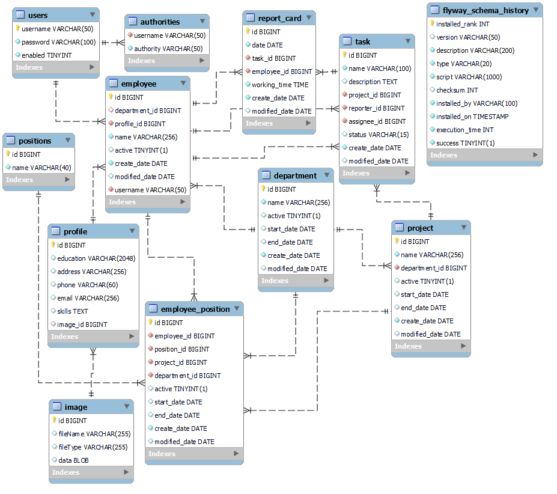

# Personnel accounting


This project is designed to account for IT company personnel.<br>
The project provides for the accounting of tasks and tracking the time spent on the tasks of each employee.

## Backend technologies
1. Java
2. MySQL
3. Hibernate
4. HikariCP
5. Flyway
6. Spring
   1. Spring Core 
   2. Spring MVC
   3. Spring Security
   4. Spring REST
7. Thymeleaf

## Frontend technologies
1. HTML
2. CSS
3. Bootstrap
4. JS
5. jQuery
6. Ajax

## Database schema


##Getting Started
Before launching projects, you must build an application. To start the project, run the following command:
```
docker-compose up --build
```
The application will be available at http://localhost:8080/